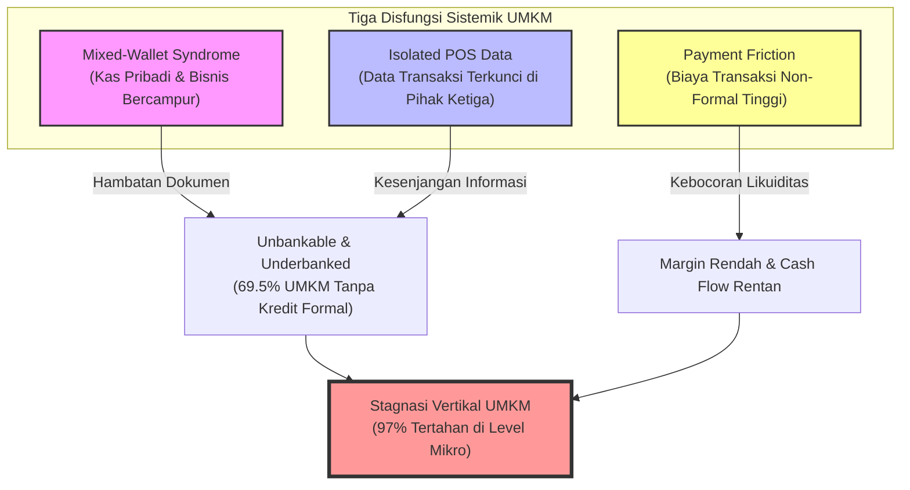
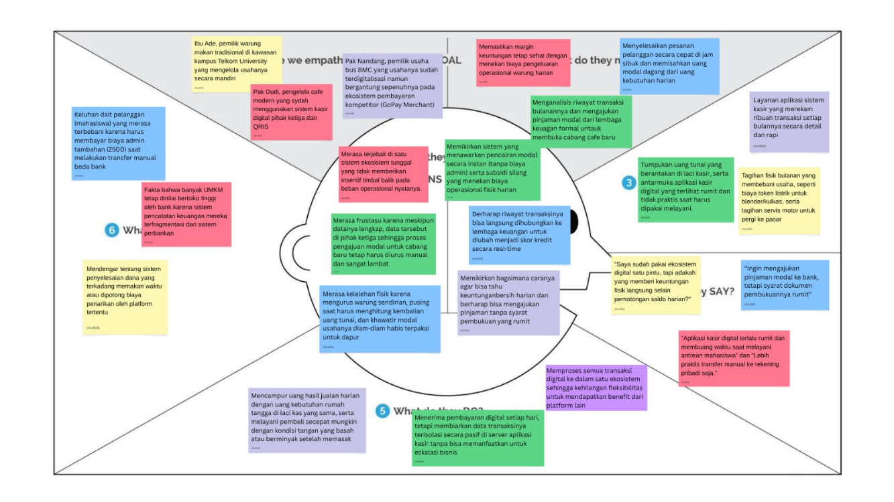

# BAB 1 — RUMUSAN MASALAH

> *"Digitalisasi pembayaran tanpa digitalisasi pengelolaan keuangan hanya menciptakan ilusi kemajuan — UMKM menjadi terdigitalisasi secara transaksional namun tetap buta secara finansial."*

---

## 1.1 Konteks Makroekonomi: Paradoks Digitalisasi UMKM Indonesia

Usaha Mikro, Kecil, dan Menengah (UMKM) membentuk tulang punggung perekonomian Indonesia, berkontribusi sebesar **61% terhadap Produk Domestik Bruto (PDB) nasional** dan menyerap lebih dari 97% angkatan kerja. Dari total **65,52 juta unit UMKM** yang beroperasi secara nasional — terdiri atas 30,18 juta unit di luar sektor pertanian (SIDT UMKM, per 31 Desember 2024) dan 29,34 juta unit di sektor pertanian (Sensus Pertanian BPS, 2023) — lebih dari 30 juta unit di antaranya telah mengadopsi instrumen pembayaran digital, terutama QRIS (Quick Response Code Indonesian Standard).

Namun, adopsi pembayaran digital ini menghadirkan paradoks yang fundamental. Berdasarkan **Survei Nasional Literasi dan Inklusi Keuangan (SNLIK) 2024** — yang untuk pertama kalinya dilaksanakan secara kolaboratif oleh Otoritas Jasa Keuangan (OJK) dan Badan Pusat Statistik (BPS) — **indeks inklusi keuangan nasional baru mencapai 75,02%**, sementara indeks literasi keuangan berada di angka 65,43%. Artinya, hampir **satu dari empat penduduk dewasa Indonesia** masih belum terjangkau oleh sistem keuangan formal, dengan disparitas yang jauh lebih dalam pada segmen pelaku usaha mikro.

Data yang lebih mengkhawatirkan datang dari sisi akses pembiayaan: **69,5% pelaku UMKM di Indonesia belum dapat mengakses fasilitas kredit perbankan** (Kementerian Koperasi dan UKM, 2025). Dari kelompok yang belum terakses tersebut, **43,1% di antaranya mengidentifikasi diri sebagai kelompok yang sangat membutuhkan kredit** untuk ekspansi usaha. Secara agregat, ini merepresentasikan lebih dari **19 juta unit UMKM** yang secara aktif membutuhkan modal namun terhalang oleh sistem penilaian kredit konvensional yang bergantung pada bukti historis keuangan formal — sebuah prasyarat yang mustahil dipenuhi oleh entitas yang selama ini beroperasi secara informal.

---

## 1.2 Validasi Lapangan: Studi Kasus Kluster UMKM Bojongsoang

Untuk memverifikasi hipotesis makro tersebut pada skala granular, tim kami melakukan serangkaian wawancara mendalam (*in-depth interviews*) terhadap **10 pelaku UMKM** di kluster perdagangan Bojongsoang, kawasan yang secara demografis merepresentasikan UMKM urban-periurban di sekitar perguruan tinggi besar di Indonesia.

*Gambar 1. Dokumentasi Wawancara Lapangan dengan Ibu Siti (Pemilik Warteg Mulya)*

Temuan lapangan mengidentifikasi tiga kategori disfungsi sistemik yang saling berkaitan dan menahan pertumbuhan UMKM secara vertikal.

---

## 1.3 Tiga Disfungsi Sistemik UMKM di Era Digital

Untuk menggambarkan keterkaitan masalah transaksional, operasional, dan struktural yang dihadapi UMKM, berikut adalah model disfungsi sistemik yang saling memperkuat (*vicious cycle*):

### Disfungsi I: Mixed-Wallet Syndrome — Percampuran Kas Bisnis dan Pribadi
* **Definisi Operasional:** Kondisi di mana pelaku usaha mikro tidak memiliki mekanisme pemisahan antara arus kas operasional bisnis (*business cash flow*) dengan pengeluaran rumah tangga (*household expenditure*), mengakibatkan distorsi profitabilitas yang sistemik dan mustahil untuk dikoreksi tanpa intervensi struktural.
* **Bukti Data Primer:** Wawancara dengan pemilik *Warteg Meriah, Warteg Mulya (2 cabang), Warteg Podom, Warteg Alwi*, dan *Laundry Permata* secara konsisten menunjukkan bahwa seluruh pelaku usaha tersebut mengelola omzet harian dan pengeluaran rumah tangga dalam satu laci kas yang sama. Akibatnya, tidak satu pun dari mereka dapat mengidentifikasi angka laba bersih secara akurat. Hanya *Jus BMC* yang telah mengadopsi sistem pencatatan formal melalui kasir digital.
* **Bukti Data Sekunder:** Laporan Kemenkop UKM menyatakan **69,5% pelaku UMKM di Indonesia unbankable** karena pembukuan yang tidak memadai.
* **Bukti Data Tersier:** Statistik nasional menunjukkan **97% pelaku usaha tetap tertahan di level mikro** akibat tata kelola arus kas yang tidak terstruktur.

### Disfungsi II: Payment Friction — Biaya Tersembunyi Transaksi Non-Formal
* **Definisi Operasional:** Mekanisme transaksi non-formal yang dipilih pelaku usaha sebagai substitusi sistem pembayaran resmi, yang justru mengakumulasikan biaya administrasi bagi seluruh pihak dalam rantai transaksi.
* **Bukti Data Primer:** Di *Warung Padang Mahkota*, konsumen non-tunai terpaksa melakukan transfer manual ke akun e-wallet DANA pribadi pemilik warung — sebuah praktik yang memicu beban biaya administrasi sebesar **Rp2.500 per transaksi** bila dikirimkan dari rekening bank konvensional. Pada frekuensi transaksi rata-rata 40 transaksi per hari, akumulasi kebocoran biaya mencapai **Rp100.000 per hari** atau **Rp3.000.000 per bulan**.
* **Implikasi Regulatoris:** Praktik ini berpotensi melanggar ketentuan Bank Indonesia yang melarang merchant membebankan biaya tambahan (*surcharge*) kepada konsumen atas transaksi digital. Padahal, kebijakan MDR QRIS per 1 Desember 2024 menetapkan tarif **0%** untuk transaksi di bawah Rp500.000 pada kategori Usaha Mikro (UMI) dan **0,3%** untuk di atasnya.
* **Bukti Data Sekunder:** SNLIK 2024 mengidentifikasi adanya *literacy gap* antara kepemilikan instrumen pembayaran dengan pemahaman cara menggunakannya secara efisien.

### Disfungsi III: Isolated POS Data — Data Transaksi yang Terkunci dan Terbengkalai
* **Definisi Operasional:** Kondisi di mana merchant yang telah mengadopsi sistem kasir digital (*Point-of-Sale*/POS) memiliki volume data transaksi yang substansial, namun data tersebut tersegregasi dalam ekosistem tertutup milik vendor POS dan tidak dapat dimanfaatkan sebagai aset strategis untuk akses pembiayaan.
* **Bukti Data Primer:** Kafe modern seperti *Rolun Coffee, Diagram Coffee*, dan *GROI* telah mengadopsi sistem POS digital (Notain, Majoo) dengan QRIS CPM (*Customer Presented Mode*). Sistem ini merekam ribuan data transaksi setiap bulannya, namun data tersebut hanya tersimpan pasif di server milik vendor POS pihak ketiga. Pengajuan kredit ekspansi tetap dilakukan manual dan lambat.
* **Implikasi Struktural & Regulasi:** Data yang secara teknis mampu membuktikan kelayakan kredit tidak dapat dimanfaatkan karena ketiadaan jembatan data terstandarisasi. Hal ini kini didukung oleh **Peraturan OJK Nomor 29 Tahun 2024 tentang Pemeringkat Kredit Alternatif (PKA)**, yang secara resmi mengakui data transaksi digital (termasuk riwayat QRIS) sebagai data alternatif yang sah untuk penilaian kelayakan kredit.

---

## 1.4 Empathy Map: Sintesis Perilaku Pengguna

Berdasarkan hasil wawancara lapangan, berikut adalah peta empati (*empathy map*) pelaku usaha mikro di Bojongsoang:

*Gambar 2. Empathy Map UMKM Kluster Bojongsoang*

| SAYS (Apa yang Dikatakan) | THINKS (Apa yang Dipikirkan) |
|---|---|
| • *"Aplikasi kasir terlalu rumit dan membuang waktu saat antrean panjang."* • *"Lebih praktis transfer manual ke rekening pribadi saja."* • *"Pembeli mengeluh kalau harus bayar biaya admin transfer manual."* | • *"Bagaimana bisa tahu untung bersih kalau uang jualan dan harian selalu bercampur?"* • *"Ingin mengajukan pinjaman modal, tetapi syarat dokumen pembukuannya terlalu rumit."* |
| **DOES (Apa yang Dilakukan)** | **FEELS (Apa yang Dirasakan)** |
| • Mencampur omzet harian dengan uang dapur. • Melayani pembeli secepat mungkin dengan tangan basah setelah memasak. • Enggan menggunakan merchant resmi karena proses admin membingungkan. | • **Kelelahan:** Fisik lelah mengelola warung sendiri dan pusing menghitung kembalian tunai di jam sibuk. • **Kekhawatiran:** Takut kalau modal usaha habis terpakai untuk kebutuhan pribadi tanpa disadari. |

---

## 1.5 Snapshot Persona Target: Jembatan Menuju Solusi

Untuk mempermudah pemahaman segmentasi target pengguna, berikut adalah snapshot dari dua persona utama yang kami temukan di lapangan:

### Persona A: Ibu Siti (The Analog Operator — UMKM Mikro)
* **Profil:** Pemilik Warteg Mulya, mengelola usaha secara mandiri.
* **Karakteristik Keuangan:** Omzet harian Rp600.000 – Rp1.200.000, kas campur aduk, tidak memiliki aset jaminan formal (agunan).
* **Hambatan Utama:** Resistensi antarmuka digital. Ia menuntut kecepatan operasional tanpa harus menyentuh layar HP saat tangan kotor.
* **Kebutuhan:** QRIS tanpa admin, pemisahan kas otomatis, dan asisten suara tanpa sentuh (*voice widget*).

### Persona B: Narjo (The Data-Rich Underserved — UMKM Menengah)
* **Profil:** Pemilik Rolun Coffee, memiliki manajemen usaha terstruktur.
* **Karakteristik Keuangan:** Omzet harian Rp3.000.000 – Rp6.000.000, menggunakan POS digital (Majoo/Notain), data tersimpan rapi.
* **Hambatan Utama:** Kesenjangan integrasi data. Data transaksinya terkunci di platform kasir pihak ketiga dan tidak diakui sebagai jaminan oleh bank konvensional.
* **Kebutuhan:** SDK jembatan data transaksi kasir ke lembaga pembiayaan untuk pengajuan modal ekspansi tanpa agunan tambahan.

---

## 1.6 Problem Statement Terstruktur

Berdasarkan analisis multidimensi di atas, problem statement dirumuskan sebagai berikut:

> **Pelaku UMKM kuliner dan ritel di Indonesia** — yang merepresentasikan lebih dari 65 juta unit usaha dengan kontribusi 61% PDB —
> **membutuhkan** sebuah infrastruktur finansial terintegrasi yang secara otomatis memisahkan arus kas bisnis dari pengeluaran pribadi, mengkonversi data transaksi digital menjadi aset kredit yang diakui lembaga keuangan (sesuai POJK 29/2024), dan memberikan kecerdasan prediktif berbasis data pangan nasional untuk mendukung keputusan operasional harian;
> **karena** sistem digital saat ini hanya menyelesaikan masalah transaksi di permukaan (transaksional semata), tanpa menyentuh akar disfungsi yang sesungguhnya: ketidakmampuan UMKM membangun identitas keuangan formal untuk mengakses 69,5% fasilitas kredit produktif nasional yang saat ini tidak dapat mereka jangkau.

---

*File 1 dari 4 — Lanjut ke BAB2_SOLUSI.md*
