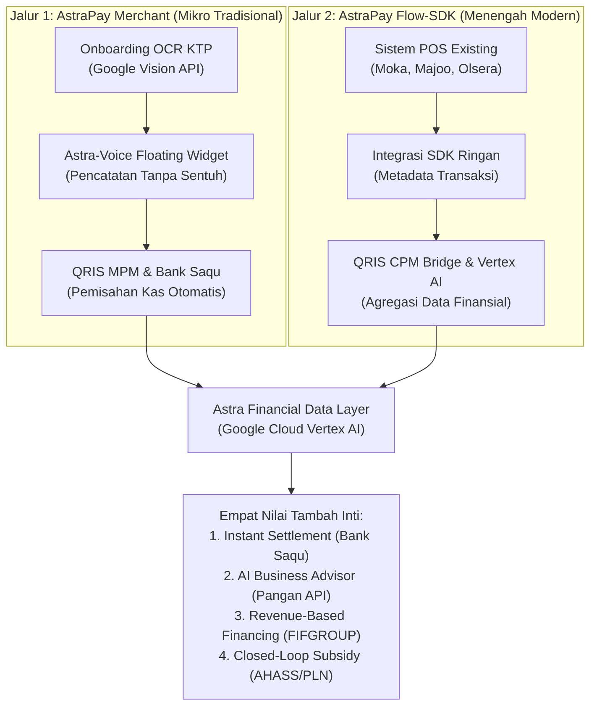
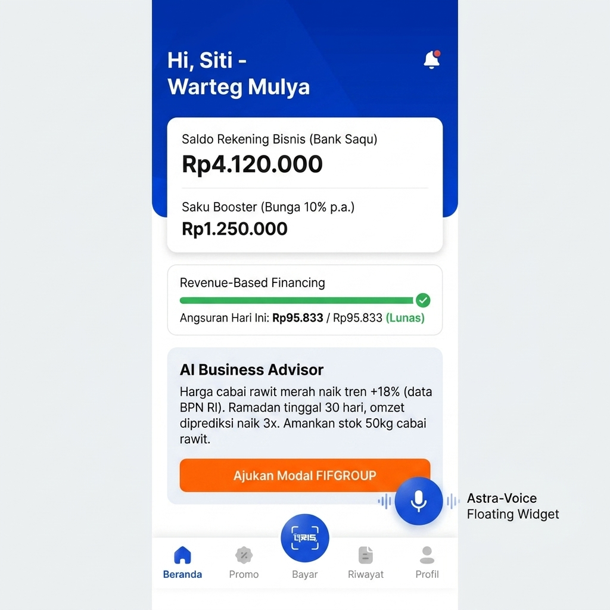
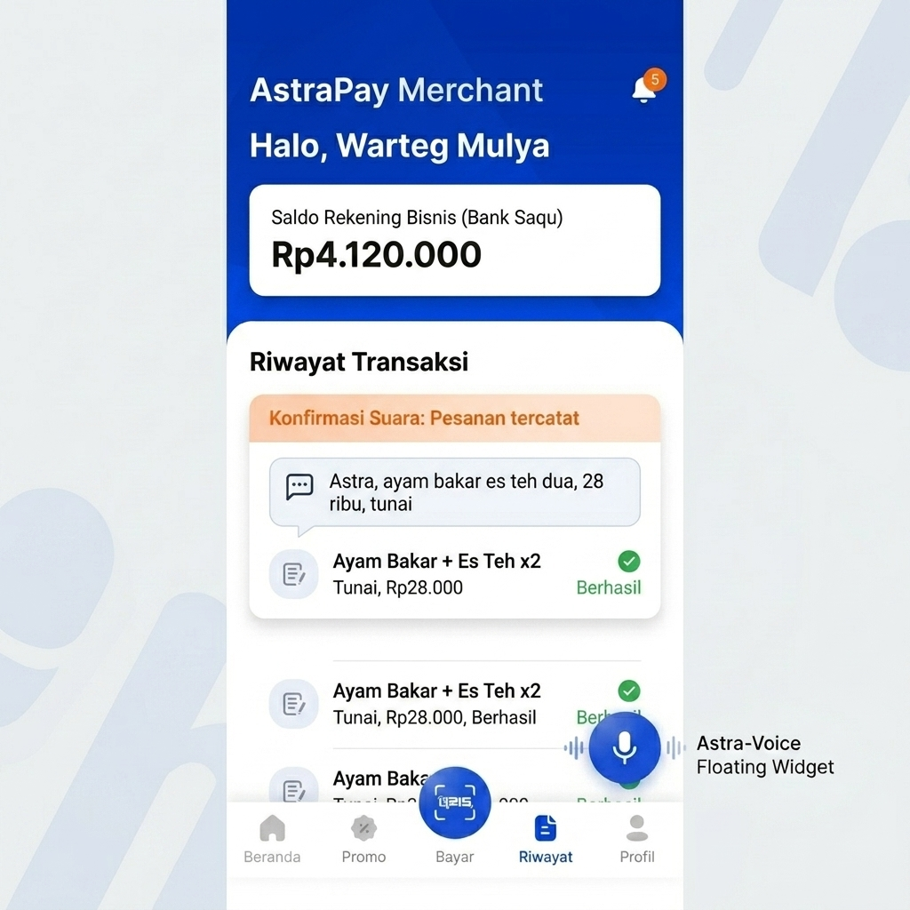
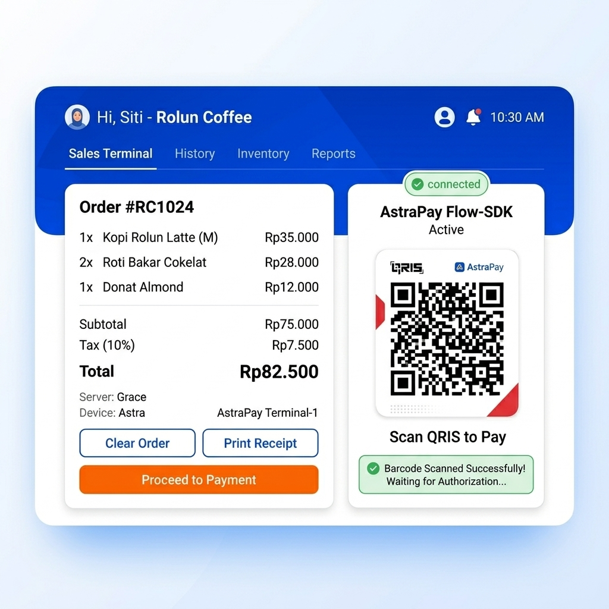
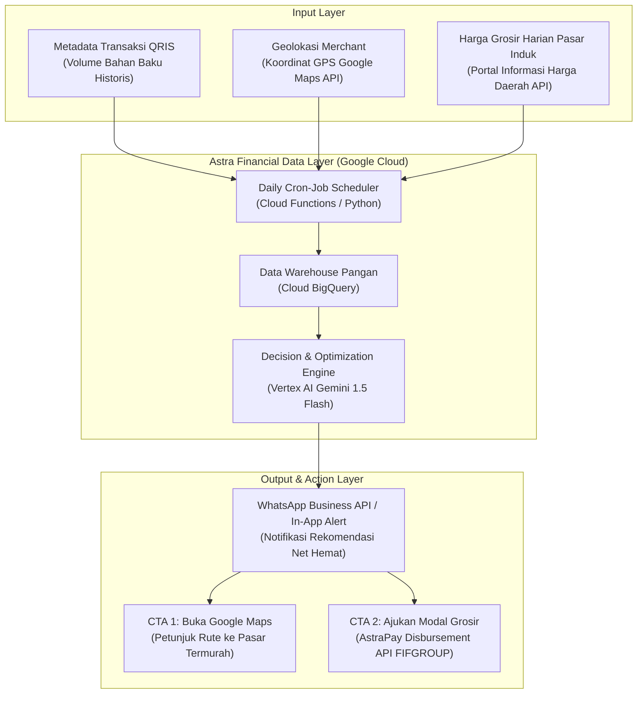
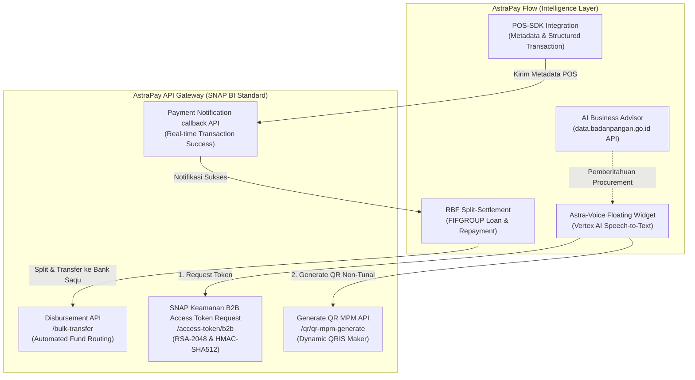

# BAB 2 — SOLUSI: AstraPay Flow — Embedded Finance & AI Business Advisor

> *"Solusi yang benar bukan menambah satu aplikasi lagi ke ponsel pedagang — melainkan menjadikan setiap gesek QRIS sebagai titik data yang bekerja untuk masa depan finansial mereka, diam-diam, tanpa interupsi."*

---

## 2.1 Kerangka Arsitektur Solusi: Dual-Channel Framework

**AstraPay Flow** adalah sebuah sistem *embedded finance* yang dirancang berdasarkan prinsip **non-disruptive integration** — tidak mengganti ekosistem yang sudah ada, melainkan menjadi lapisan kecerdasan finansial yang menempel di atasnya. Arsitektur ini bertumpu pada **Dual-Channel Framework**: dua jalur adopsi yang berbeda secara teknis namun konvergen pada infrastruktur data dan pembiayaan yang sama.

*Gambar 3. Arsitektur Sistem AstraPay Flow — Dual-Channel Framework*

Pilihan desain ini didorong oleh satu prinsip bisnis yang fundamental: **biaya adopsi teknologi harus nol bagi merchant**. Jika merchant harus belajar aplikasi baru, antrean terhenti. Jika kafe harus mengganti sistem kasir yang sudah berjalan, penolakan adalah kepastian.

---

## 2.2 Jalur Pertama: AstraPay Merchant — untuk UMKM Mikro Tradisional

**Target:** Pelaku usaha mikro seperti *Warteg Mulya, Warteg Alwi, Warteg Podom* — yang resisten terhadap antarmuka digital namun sudah memiliki smartphone Android.

### 2.2.1 Zero-Friction Onboarding via Agen Lapangan FIFGROUP
Hambatan utama onboarding merchant mikro bukan teknologinya, melainkan proses administrasinya. Strategi yang kami rancang memanfaatkan **jaringan surveyor lapangan FIFGROUP** yang telah eksis di ribuan kecamatan di Indonesia — mengubah agen yang sudah beroperasi menjadi *onboarding agent* AstraPay tanpa rekrutmen baru.

Prosesnya: agen mendatangi warung dan membantu pendaftaran merchant menggunakan aplikasi internal dengan fitur **OCR KTP otomatis** yang ditenagai oleh **Google Cloud Vision API** (bagian dari ekosistem kemitraan Astra-Google Cloud November 2023). Hal ini mengeliminasi kesalahan pengetikan nama dan nomor rekening secara manual. QRIS resmi langsung aktif dalam kurang dari 5 menit. **Biaya akuisisi merchant (CAC) mendekati Rp0** karena memanfaatkan *shared cost* jaringan lapangan yang sudah ada.

### 2.2.2 Astra-Voice Floating Widget — Pencatatan via Perintah Suara
Inovasi antarmuka yang kami rancang menjawab satu hambatan psikologis mendasar: **tangan pedagang tidak pernah kosong**. Saat sedang memasak, menguleni adonan, atau melayani antrean — membuka aplikasi adalah kemewahan yang tidak terjangkau.

**Mekanisme kerja:**
1. **Persistent Overlay:** Aplikasi AstraPay Merchant memunculkan tombol mikrofon melayang (*floating widget*) yang aktif persisten di layar Android pedagang.
2. **One-Tap Listening:** Satu ketukan pada widget mengaktifkan mode perekaman suara (Speech-to-Text) tanpa membuka antarmuka utama aplikasi.
3. **Natural Language Processing (NLP):** Pedagang berbicara normal, misalnya: *"Astra, ayam bakar es teh dua, 28 ribu, tunai"*.
4. **Vertex AI Processing:** Algoritma NLP memproses teks tersebut untuk mendeteksi *intent* (pencatatan transaksi), *item* (ayam bakar, es teh), *nominal* (Rp28.000), dan *payment_method* (cash).
5. **Voice Confirmation:** Aplikasi mengonfirmasi secara instan melalui suara: *"Dicatat Bos, kembalian 22 ribu dari uang 50 ribu"*.

Sistem pemisahan kas berjalan **secara otomatis dan senyap**: seluruh penerimaan QRIS mengalir langsung ke rekening bisnis terpisah di **Bank Saqu** (bank digital resmi besutan Astra Group), terlepas dari dompet pribadi pemilik. *Mixed-Wallet Syndrome* teratasi tanpa satu pun perubahan perilaku aktif dari pedagang.

*Gambar 4. Antarmuka Dashboard Utama Merchant AstraPay Flow*

*Gambar 5. Detail Antarmuka Interaktif Astra-Voice Floating Widget (Pencatatan Perintah Suara)*

---

## 2.3 Jalur Kedua: AstraPay Flow-SDK — untuk UMKM Menengah Modern

**Target:** Usaha modern seperti *Rolun Coffee, Diagram Coffee, GROI* yang sudah menggunakan POS pihak ketiga (Moka, Majoo, Olsera, Pawoon, Notain).

### 2.3.1 Embedded Finance via SDK — Tanpa Mengganti Sistem yang Ada
AstraPay tidak membangun POS baru untuk bersaing dengan vendor yang sudah mapan. Strategi tersebut sangat tidak efisien dan rentan penolakan karena merchant enggan mengganti sistem operasional utama mereka.

Asal-usul integrasinya menggunakan **Software Development Kit (SDK) ringan** yang diinjeksikan ke dalam sistem POS eksis milik merchant. Dari perspektif kasir, tidak ada yang berubah. Di balik layar, setiap transaksi yang diselesaikan kini secara bersamaan mengirimkan *metadata* transaksi terstruktur melalui endpoint API yang aman ke **Astra Financial Data Layer**:
* `merchant_id`: ID terdaftar merchant.
* `transaction_id`: ID transaksi unik.
* `timestamp`: Waktu transaksi presisi (ISO 8601).
* `items_detail`: Nama item, kuantitas, harga, dan kategori (misal: F&B, retail).
* `payment_type`: Metode pembayaran (QRIS, Tunai, Kartu).

*Gambar 6. Antarmuka Dashboard POS Eksis yang Terintegrasi dengan AstraPay Flow-SDK*

### 2.3.2 QRIS CPM Bridge — Mengubah Gesek QR menjadi Aset Kredit
Saat kasir memindai kode QR dari smartphone pelanggan (*Customer Presented Mode* / CPM), SDK bertindak sebagai jembatan data. Data transaksi yang sebelumnya tersimpan pasif di server pihak ketiga kini mengalir ke infrastruktur **Google Cloud Vertex AI** (sesuai kemitraan strategis Astra International-Google Cloud, November 2023).

Ini adalah konversi fundamental: data transaksi yang semula merupakan **beban biaya penyimpanan** bagi vendor POS, kini didefinisikan ulang menjadi **aset kredit aktif** bagi merchant.

---

## 2.4 Empat Nilai Tambah Inti Pasca-Integrasi

### 2.4.1 Instant Zero-Cost Settlement — Likuiditas Real-Time ke Bank Saqu
Seluruh dana transaksi QRIS divalidasi dan di-*settle* ke rekening bisnis merchant di **Bank Saqu** secara instan (**0 detik**) tanpa biaya administrasi penarikan (Rp0 admin). Kecepatan perputaran kas harian (*daily cash turnover velocity*) meningkat sehingga pedagang tidak perlu lagi meminjam uang informal untuk modal belanja bahan baku segar di pasar subuh.

**Ketentuan MDR QRIS (Sesuai Regulasi Bank Indonesia per 1 Desember 2024):**
* Transaksi Kategori Usaha Mikro (UMI) ≤ Rp500.000: **MDR 0%**
* Transaksi Kategori Usaha Mikro (UMI) > Rp500.000: **MDR 0,3%**
* Kategori Usaha Kecil (UKE), Menengah (UME), dan Besar (UBE): **MDR 0,7%**

Biaya MDR ini ditanggung oleh merchant sesuai regulasi resmi Bank Indonesia dan **dilarang keras untuk dibebankan kepada konsumen** (*surcharge*).

---

### 2.4.2 Predictive Procurement & Supply Chain Intelligence — AI Business Advisor Berbasis Geolokasi

Fitur ini merupakan **diferensiasi utama AstraPay Flow yang belum dimiliki oleh kompetitor mana pun** (seperti GoBiz, GrabMerchant, atau OVO Merchant). AI Business Advisor tidak hanya mendeteksi tren inflasi secara makro, melainkan bertindak sebagai **mesin optimasi rantai pasok lokal (Supply Chain Intelligence)** yang membantu merchant membandingkan harga komoditas grosir antar-pasar induk tradisional secara real-time berdasarkan geolokasi toko mereka.

*Gambar 7. Alur Data & Arsitektur Supply Chain Intelligence AstraPay Flow*

#### 1. Serverless Tech Stack & Sumber Data (100% Legal & Open Data)
Untuk memastikan kelayakan operasional tanpa membebani sistem transaksi utama AstraPay, kami merancang infrastruktur serverless berbasis Google Cloud (memanfaatkan kemitraan strategis Astra-Google Cloud, November 2023):
*   **Data Ingestion:** Google Cloud Scheduler memicu **Cloud Functions (Python)** setiap pukul 05:00 WIB untuk melakukan pengambilan data (*scraping/API ingestion*) harga grosir komoditas harian dari portal resmi daerah (misalnya **`priangan.org`** untuk wilayah Jawa Barat, atau portal harga pangan dinas terkait).
*   **Data Warehouse:** Seluruh data historis harga grosir disimpan di **Google Cloud BigQuery** untuk analisis tren musiman.
*   **Geolokasi:** Sistem memanfaatkan **Google Maps Distance Matrix API** untuk menghitung jarak rute presisi dan estimasi waktu perjalanan dari titik koordinat GPS outlet merchant ke pasar-pasar induk terdekat (misalnya Pasar Induk Caringin vs. Pasar Induk Gedebage untuk Bandung).
*   **Recommendation Engine:** **Google Cloud Vertex AI (Gemini 1.5 Flash)** bertindak sebagai otak yang memproses data historis volume penjualan bahan baku merchant, mencocokkan harga pangan grosir terdekat, dan menyusun teks rekomendasi.

#### 2. Formulasi Matematis Perhitungan Net Hemat Ekonomis
AI Advisor akan mengeluarkan rekomendasi pasar jika selisih harga grosir memberikan keuntungan bersih setelah dikurangi biaya operasional transportasi tambahan:
$$\text{Net Hemat} = (\Delta P \times V) - C_{\text{trans}}$$

Di mana:
*   $\Delta P$ = Selisih harga grosir komoditas per kg antar-pasar ($P_{\text{pasar\_mahal}} - P_{\text{pasar\_murah}}$).
*   $V$ = Estimasi volume belanja komoditas merchant (dalam kg) berdasarkan riwayat transaksi.
*   $C_{\text{trans}}$ = Estimasi biaya operasional transportasi pulang-pergi ke pasar murah (dihitung berdasarkan rata-rata konsumsi bensin motor Honda pedagang, misalnya $1 \text{ liter Pertalite} = \text{Rp } 12.500$ untuk radius tempuh tertentu).

#### 3. Delivery Channel & Integrasi Aksi API (Call to Action)
Pemberitahuan dikirimkan secara otomatis pada pukul 06:00 WIB (sebelum pedagang berbelanja bahan baku) melalui **WhatsApp Business API** dan push notification aplikasi. Untuk meningkatkan efisiensi, notifikasi dilengkapi dengan tombol aksi langsung (*Call to Action* / CTA):
1.  **CTA 1 — "Ambil Rute Maps":** Membuka rute peta instan di Google Maps dari lokasi toko ke pasar induk termurah.
2.  **CTA 2 — "Ajukan Modal Grosir":** Jika modal cash merchant terbatas untuk memborong komoditas grosir murah tersebut, tombol ini memicu panggilan API ke **AstraPay Disbursement API (Bulk Transfer)** untuk mencairkan kredit talangan cepat FIFGROUP (DANASTRA/FINATRA) secara instan ke rekening Bank Saqu merchant dalam hitungan detik.

#### 4. Skenario Simulasi Output Notifikasi:
> *"Bos Warteg Mulya, perhatian! Berdasarkan geolokasi Anda, harga grosir cabai rawit merah hari ini di Pasar Induk Caringin lebih murah Rp8.000/kg dibandingkan Pasar Gedebage. Dengan estimasi kebutuhan mingguan Anda sebesar 50 kg, Anda dapat menghemat bersih Rp380.000 (setelah dikurangi bensin ekstra motor Honda Anda) jika berbelanja di Pasar Caringin subuh ini. Butuh modal tambahan? Klik [Ajukan Modal Grosir] untuk mencairkan Rp1.000.000 dari FIFGROUP instan ke Bank Saqu Anda, atau klik [Buka Rute] untuk petunjuk jalan."*

---

### 2.4.3 Revenue-Based Financing — Cicilan Fleksibel via Split-Settlement
Skema pembiayaan ini dirancang sesuai **POJK Nomor 29 Tahun 2024 tentang Pemeringkat Kredit Alternatif (PKA)**. Data transaksi QRIS yang terkumpul melalui SDK dievaluasi oleh penyelenggara PKA berlisensi OJK (PT PEFINDO Biro Kredit / IdScore) untuk menerbitkan skor kredit digital sebagai pengganti agunan fisik.

Skema pembayaran ini **bukan biaya tambahan di atas MDR QRIS** (yang melanggar ketentuan BI), melainkan pemotongan kewajiban cicilan kredit produktif FIFGROUP pada proses *settlement* dana ke Bank Saqu.

**Formula Matematis Pembagian Settlement Harian:**
Misalkan:
* Plafon Pinjaman ($P$) = Rp15.000.000
* Tenor ($T$) = 6 Bulan
* Bunga Flat Bulanan ($r$) = 2,5% (Sesuai suku bunga FIFGROUP DANASTRA)
* Total Kewajiban Utang ($O$) = $P \times (1 + r \times T)$
  $$O = 15.000.000 \times (1 + 0,025 \times 6) = 17.250.000$$
* Cicilan Bulanan ($M$) = $O / T = 17.250.000 / 6 = 2.875.000$
* Target Cicilan Harian ($D$) = $M / 30 = 2.875.000 / 30 = 95.833$

Pada hari ke-$t$, sistem menerima total omzet harian QRIS merchant sebesar $G_t$ sebelum di-settle ke rekening Bank Saqu.
Mekanisme split-settlement bekerja sebagai berikut:
1. **Kondisi Normal ($G_t \ge D$):**
   * Dana sebesar $D$ (Rp95.833) secara otomatis ditransfer ke rekening penampung cicilan FIFGROUP.
   * Sisa dana $G_t - D$ ditransfer langsung ke rekening operasional Bank Saqu merchant.
2. **Kondisi Khusus/Hari Libur ($G_t < D$):**
   * Seluruh dana $G_t$ ditarik ke rekening FIFGROUP.
   * Kekurangan sebesar $D - G_t$ akan didebit otomatis dari saldo mengendap di Bank Saqu merchant pada hari berikutnya ketika omzet kembali normal (tanpa mengenakan bunga bergulung / *compound interest* sesuai **POJK Nomor 6/POJK.07/2022 tentang Perlindungan Konsumen**).
   * Merchant dapat mengaktifkan fitur *Cicilan Libur* via aplikasi untuk menunda cicilan selama maksimal 3 hari saat toko terpaksa tutup (misalnya hari raya).

Untuk menjaga keadilan dan likuiditas merchant, sisa dana yang mengendap di Bank Saqu dipisahkan ke dalam **Saku Booster** dengan bunga **10% p.a.** yang difungsikan sebagai dana cadangan produktif untuk pembayaran cicilan harian berikutnya.

**AI-Driven Early Warning System (EWS) — Proteksi Gagal Bayar Proaktif:**
Untuk melengkapi sistem Revenue-Based Financing, Google Cloud Vertex AI bertindak sebagai mesin penilai risiko proaktif (*Early Warning System*). EWS secara otomatis memantau stabilitas omzet harian merchant dari data settlement QRIS dan mengambil tindakan preventif sebelum merchant mengalami gagal bayar teknis (*default*):
*   **Pemicu EWS:** Terjadi penurunan omzet harian merchant sebesar **$\ge 30\%$ selama 3 hari berturut-turut** dibandingkan rata-rata historis (misalnya akibat cuaca buruk ekstrem, libur semesteran universitas sekitar Bojongsoang, atau gangguan rantai pasok).
*   **Aksi Mitigasi 1 — Penyesuaian Cicilan Harian Otomatis:** EWS mengirimkan instruksi ke core system FIFGROUP untuk **merestrukturisasi cicilan harian secara otomatis** (misalnya memotong nominal tagihan harian menjadi 50% selama 3 hari ke depan tanpa pengenaan denda bunga bergulung/administratif).
*   **Aksi Mitigasi 2 — Rekomendasi Efisiensi Logistik Belanja:** AI Advisor secara bersamaan mengirimkan rekomendasi alternatif pasar grosir termurah (melalui fitur *Supply Chain Intelligence*) ke WhatsApp merchant untuk membantu menekan pengeluaran belanja bahan baku agar margin keuntungan tetap terjaga selama masa omzet turun.

---

### 2.4.4 Closed-Loop Cost Subsidy — Subsidi Biaya Operasional Nyata
Setiap transaksi QRIS yang diproses menghasilkan poin loyalitas yang dapat ditukarkan langsung dengan kebutuhan fisik operasional UMKM:
* **Subsidi Energi:** Voucher token listrik PLN untuk memotong pengeluaran tetap bulanan warung.
* **Subsidi Armada:** Voucher ganti oli dan servis motor di jaringan bengkel resmi **AHASS (Astra Honda Motor)**.

**Analisis Kelayakan Biaya (Corporate Viability):**
Pemberian oli gratis di AHASS dihitung menggunakan **Cost of Goods Sold (COGS) internal manufaktur Astra** (sekitar Rp15.000) dibandingkan harga retail pasar (Rp50.000). Hal ini memberikan keuntungan ganda: merchant merasakan nilai penghematan yang tinggi, sementara biaya nyata bagi ekosistem Astra tetap minimal karena menggunakan integrasi rantai pasok internal.

---

## 2.5 Pemetaan Integrasi Teknis pada Arsitektur API Eksis AstraPay (SNAP BI)

Untuk membuktikan kelayakan implementasi (*feasibility*), solusi **AstraPay Flow** dirancang dengan prinsip **non-disruptive API integration**. Kami tidak membangun payment gateway baru atau merombak sistem pemrosesan transaksi AstraPay yang telah berjalan. Sebaliknya, kami memanfaatkan dan memetakan fitur inovatif kami ke dalam arsitektur **Open API SNAP BI (Standar Nasional Open API Pembayaran)** resmi yang terdokumentasi di portal developer AstraPay (`docs.astrapay.com`).

Berikut adalah detail bagaimana fitur-fitur baru AstraPay Flow menempel secara modular pada arsitektur API eksis AstraPay:

*Gambar 8. Arsitektur Integrasi API AstraPay Flow dengan Infrastruktur SNAP BI Eksis*

### 2.5.1 Mekanisme Otentikasi Keamanan (X-SIGNATURE)
Seluruh komunikasi data antara *AstraPay Flow* (baik melalui *floating widget* maupun *Flow-SDK* pada POS) menggunakan standar keamanan tingkat tinggi SNAP BI yang saat ini telah aktif di platform AstraPay:
1. **Signature Auth (Token B2B):** Setiap kali aplikasi diaktifkan, merchant mengirimkan *request* untuk mendapatkan Access Token melalui endpoint `/snap-service/snap/v1.0/access-token/b2b` dengan metode `POST` dan parameter `"grantType": "client_credentials"`. Otentikasi menggunakan hashing **SHA-256** dengan enkripsi asimetris **RSA-2048** menggunakan Private Key Merchant yang di-encode ke Base64. Token ini memiliki masa kedaluwarsa standar **900 detik (15 menit)**.
2. **Signature Service (Data/Transaction Services):** Transaksi berikutnya diamankan menggunakan token bearer tersebut bersama dengan header `X-SIGNATURE` yang di-hash dengan metode **HMAC-SHA512** (simetris) menggunakan *Client Secret* dari AstraPay sebagai kuncinya.

### 2.5.2 Integrasi Alur Transaksi pada Endpoint Pembayaran
1. **Pemicu Dynamic QRIS via Perintah Suara:** Ketika *Astra-Voice Floating Widget* mendeteksi instruksi non-tunai (misalnya, *"Astra, ayam bakar es teh dua, 28 ribu, QRIS"*), modul pemrosesan teks Vertex AI mengekstrak nominal Rp28.000 dan langsung melakukan panggilan API ke endpoint Generate QR MPM:
   * **URL:** `/qris-service/snap/v1.0/qr/qr-mpm-generate`
   * **Verb:** `POST`
   * **Payload:** Mengirimkan parameter `amount`, `merchantId`, dan `validityPeriod` (waktu aktif QRIS maksimal 24 jam).
   * **Output:** Sistem mengembalikan string URL QRIS yang langsung dirender menjadi kode QR di layar pedagang.
2. **Sinyal Instan via Callback (Payment Notification):** Begitu pelanggan memindai QRIS dan membayar, gerbang pembayaran AstraPay mengirimkan sinyal callback pembayaran sukses ke endpoint Merchant (`Payment Notification callback API`). Sinyal inilah yang memicu *Instant Settlement* ke rekening Bank Saqu dalam 0 detik dan memperbarui buku kas merchant.
3. **Penyelesaian Dana & Split-Settlement via API Disbursement:** Untuk mekanisme pembayaran cicilan harian *Revenue-Based Financing* (RBF) FIFGROUP (DANASTRA/FINATRA), kami memanfaatkan **AstraPay Disbursement API** (Bulk Transfer). Saat dana transaksi QRIS siap dicairkan secara massal (*bulk*), sistem settlement secara otomatis memotong target cicilan harian ($D$ = Rp95.833 untuk pinjaman Rp15 juta) untuk ditransfer ke rekening penampung FIFGROUP, sedangkan sisa dana ($G_t - D$) dialihkan ke rekening Bank Saqu merchant melalui satu kali panggilan API bulk transfer.

---

## 2.6 Konfigurasi Infrastruktur Teknologi

| Komponen Sistem | Teknologi Terintegrasi | Status & Sumber Ketersediaan |
|---|---|---|
| **AI Advisor Engine** | Google Cloud Vertex AI (Gemini) | Tersedia via Kemitraan Astra-Google Cloud (Nov 2023) |
| **Data Harga Pangan** | API Badan Pangan Nasional & data.go.id | Terintegrasi secara legal, gratis (Open Data) |
| **Credit Scoring Engine** | POJK 29/2024 PKA — via PT PEFINDO Biro Kredit (IdScore) | Berlisensi OJK |
| **Settlement Interface** | AstraPay SNAP BI | Modul standardisasi Bank Indonesia |
| **Rekening Bisnis** | Bank Saqu (Saku Utama & Saku Booster) | Platform Bank Digital Astra |
| **Pembiayaan Produktif** | FIFGROUP FINATRA / DANASTRA | Unit Bisnis Jasa Keuangan Astra, portfolio Rp45,9T |
| **Onboarding Agent** | Jaringan Surveyor Lapangan FIFGROUP | Sumber daya manusia internal eksis |

---

*File 2 dari 4 — Lanjut ke BAB3_TARGET_USER.md*

