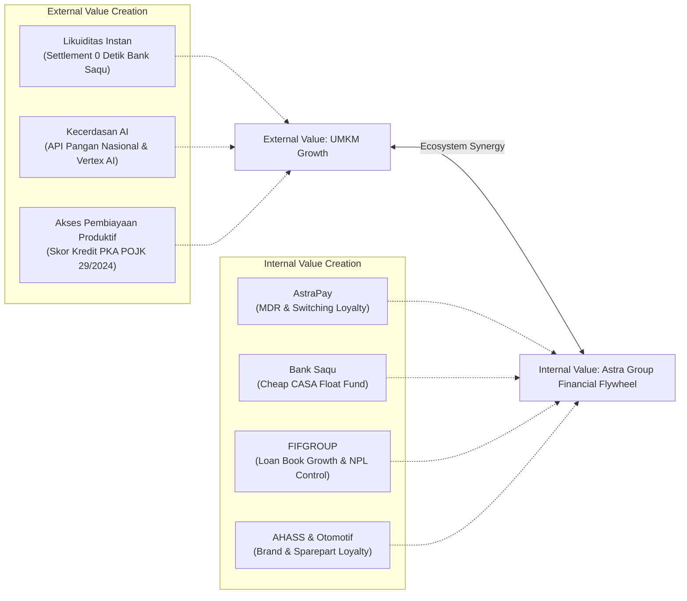
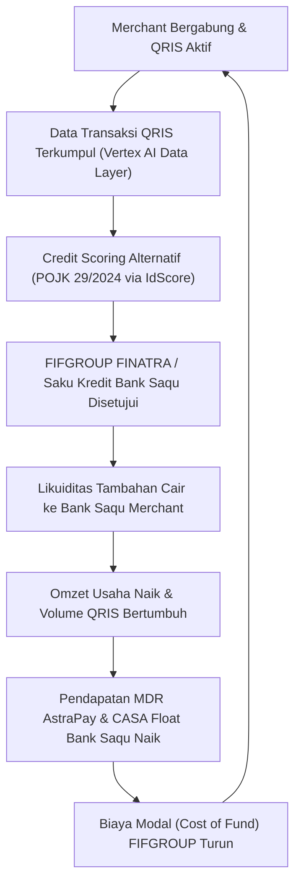

# BAB 4 — BUSINESS IMPACT

> *"Sebuah solusi yang baik menyelesaikan masalah pengguna. Sebuah solusi yang luar biasa melakukannya sambil menciptakan bisnis yang secara ekonomi menguntungkan semua pihak dalam ekosistem — termasuk perusahaan yang membiayainya."*

---

## 4.1 Kerangka Analisis: Dual-Value Matrix

Dampak bisnis AstraPay Flow dianalisis menggunakan **Dual-Value Matrix** — sebuah kerangka evaluasi dua sisi yang mengukur dampak secara simetris:

1. **External Value Creation** — nilai yang diciptakan bagi pelaku UMKM sebagai pengguna.
2. **Internal Ecosystem Synergy** — nilai yang dihasilkan bagi setiap lini bisnis Astra Group yang terlibat.

*Gambar 9. Kerangka Analisis Dual-Value Matrix AstraPay Flow*

Pendekatan ini membuktikan bahwa AstraPay Flow bukan sekadar program CSR berbiaya tinggi — melainkan sebuah **arsitektur bisnis yang menguntungkan secara komersial** di setiap lapisan ekosistem.

---

## 4.2 External Value Creation — Dampak Akselerasi UMKM

### 4.2.1 Kuantifikasi Problem yang Diselesaikan

Sebelum membicarakan dampak, penting menegaskan skala masalah yang diselesaikan dengan angka yang terverifikasi:

| Indikator Masalah | Data Aktual | Sumber |
|---|---|---|
| UMKM tanpa akses kredit formal | **69,5%** dari ~65 juta unit | Kemenkop UKM, 2025 |
| UMKM yang "sangat butuh" kredit | **43,1%** dari yang belum akses | Kemenkop UKM, 2025 |
| Jumlah UMKM potensial target | **~19 juta unit** | Kalkulasi dari data di atas |
| Merchant QRIS yang adalah UMKM | **90-93%** dari 32,71 juta merchant | Bank Indonesia, 2024 |
| Indeks inklusi keuangan nasional | **75,02%** (target 90% belum tercapai) | OJK-BPS SNLIK 2024 |

> [!NOTE]
> AstraPay Flow menjawab kebutuhan yang tidak dipenuhi oleh ekosistem keuangan formal yang ada — dan melakukannya dengan pendekatan yang regulatoris sesuai POJK 29/2024 tentang Pemeringkat Kredit Alternatif.

### 4.2.2 Transformasi Finansial per Arketipe

1. **Arketipe 1 — Analog Operator (Warteg Mulya - Ibu Siti):**
   * *Sebelum:* Tidak memiliki laporan keuangan → mustahil mendapatkan kredit formal.
   * *Sesudah:* Data transaksi QRIS diakumulasi selama 4 bulan → credit assessment berbasis PKA (POJK 29/2024) → akses pembiayaan DANASTRA Rp15.000.000 dengan pencairan bersih Rp13.160.000 (setelah potongan upfront admin & asuransi).
   * *Dampak Konkret:* Menghilangkan ketergantungan pada pinjaman informal/tengkulak dengan bunga yang menjerat.

2. **Arketipe 2 — Data-Rich Underserved (Rolun Coffee - Narjo):**
   * *Sebelum:* Ribuan data transaksi POS tersimpan pasif di server Majoo → 0 nilai finansial.
   * *Sesudah:* Integrasi SDK ringan → 3 bulan akumulasi → penilaian kelayakan kredit otomatis oleh PT PEFINDO Biro Kredit → persetujuan pembiayaan produktif FINATRA Rp50.000.000 dengan pencairan bersih Rp47.890.000.
   * *Dampak Konkret:* Memangkas waktu pengajuan kredit ekspansi cabang baru dari rata-rata 30-45 hari kerja di bank konvensional menjadi 24-48 jam kerja.

3. **Arketipe 3 — Platform-Trapped (Jus BMC - Pak Yosef):**
   * *Sebelum:* Terkunci di platform kompetitor (GoPay) dan unbankable karena ketiadaan jaminan/agunan fisik.
   * *Sesudah:* Migrasi bertahap ke QRIS AstraPay → akses Bank Saqu Saku Kredit Rp20.000.000 tanpa agunan dengan cicilan harian Rp65.556 (hanya 10,9% dari rata-rata omzet harian Rp600.000).
   * *Dampak Konkret:* Menghapus barrier agunan fisik yang selama ini menahan 43,1% UMKM mikro berkembang.

---

## 4.3 Internal Ecosystem Synergy — Dampak bagi Astra Group

### 4.3.1 AstraPay — Ekspansi Volume Transaksi & Retensi Merchant

**Potensi pasar langsung:**
* Merchant QRIS nasional: **32,71 juta** (2024), dengan pertumbuhan **175,2% YoY**.
* Target konversi tahun pertama: **10.000 merchant aktif** (Bojongsoang + 5 kluster kampus).
* Nilai transaksi QRIS nasional 2024: **Rp467 triliun**.

**Revenue stream AstraPay dari merchant yang terkonversi:**
* Pada omzet rata-rata Rp900.000/hari per merchant.
* Estimasi Gross Transaction Value (GTV) tahun pertama:
  $$\text{GTV} = 10.000 \text{ merchant} \times \text{Rp } 900.000/\text{hari} \times 300 \text{ hari aktif} = \mathbf{\text{Rp } 2,7 \text{ triliun/tahun}}$$
* Sesuai ketentuan Bank Indonesia, MDR QRIS kategori Usaha Mikro (UMI) adalah 0,3% untuk transaksi di atas Rp500.000.
* Estimasi Revenue MDR AstraPay (mengasumsikan rata-rata transaksi di atas batas minimum):
  $$\text{Revenue MDR} = \text{Rp } 2,7 \text{ triliun} \times 0,3\% = \mathbf{\text{Rp } 8,1 \text{ miliar/tahun}}$$

> [!TIP]
> Merchant yang terintegrasi memiliki biaya perpindahan (*switching cost*) yang sangat tinggi karena reputasi data kredit mereka terikat secara eksklusif pada track record transaksi di QRIS AstraPay. Ini menciptakan loyalitas struktural jangka panjang.

### 4.3.2 Bank Saqu — CASA Flywheel & Akuisisi Nasabah Zero-Cost

Setiap merchant yang onboarding wajib membuka rekening bisnis di Bank Saqu sebagai instrumen settlement. Hal ini menghasilkan akuisisi nasabah secara organik dengan **CAC (Customer Acquisition Cost) mendekati Rp0**, karena onboarding dilakukan oleh surveyor lapangan FIFGROUP yang sudah digaji.

**Dampak pada neraca Bank Saqu:**
* Setiap rekening merchant mengakumulasikan dana mengendap (*float fund*) harian dari settlement QRIS sebelum dicairkan untuk belanja operasional.
* Pada 10.000 merchant dengan proyeksi rata-rata saldo mengendap Rp500.000 per merchant:
  $$\text{Float Fund} = 10.000 \times \text{Rp } 500.000 = \mathbf{\text{Rp } 5 \text{ miliar}}$$
* Rp5 miliar dana murah (*cheap funding*) mengalir langsung ke Current Account Savings Account (CASA) Bank Saqu tanpa biaya pemasaran ritel.

**Produk Bank Saqu yang aktif digunakan:**
* **Saku Booster (Bunga 10% p.a. - Tabungmatic):** Untuk mengendapkan surplus harian merchant agar tetap produktif.
* **Busposito (Bunga 7,0% s.d. 8,8% p.a.):** Untuk merchant yang ingin mendepositokan keuntungan jangka menengah.
* **Saku Kredit:** Kredit produktif digital tanpa agunan (maksimal Rp30 juta) untuk Arketipe 3.

### 4.3.3 FIFGROUP — Penetrasi Kredit Produktif Berisiko Rendah

**Kapasitas FIFGROUP (Berdasarkan Annual Report Astra 2024):**
* Laba bersih FIFGROUP 2024: **Rp4,4 triliun** (+7,5% YoY).
* Portofolio pinjaman aktif: **Rp45,9 triliun** (+8,5% YoY).
* Rasio Non-Performing Financing (NPF/NPL) aktual: **1,18%** (kategori sangat sehat).

AstraPay Flow menghadirkan data transaksi alternatif real-time yang meminimalkan risiko NPL pembiayaan produktif FIFGROUP.

> [!IMPORTANT]
> **Proyeksi NPL & Mitigasi Risiko:**
> Skema *split-settlement* otomatis saat QRIS dicairkan ke rekening Bank Saqu meminimalkan risiko gagal bayar teknis (*default*). Ketika terdeteksi penurunan omzet harian merchant sebesar **$\ge 30\%$ selama 3 hari berturut-turut**, **AI-Driven Early Warning System (EWS)** secara otomatis memicu restrukturisasi cicilan harian (memotong nominal cicilan hingga 50% tanpa denda bunga bergulung) dan merekomendasikan efisiensi biaya bahan baku via *Supply Chain Intelligence*. Target NPL pembiayaan ini ditetapkan setara atau lebih baik dari NPL aktual FIFGROUP, yaitu **≤1,18%** sesuai dengan standar **POJK Nomor 6/POJK.07/2022**.

**Skenario pendapatan FIFGROUP dari 10.000 merchant (SOM Tahun 1):**
* Asumsi konversi ke pembiayaan aktif sebesar 30% (3.000 merchant):
  * **2.000 merchant** (Arketipe 1 - DANASTRA Rp15M dan Arketipe 3 - Saku Kredit Rp20M) dengan rata-rata pinjaman Rp17.500.000 $\rightarrow$ Rp35 miliar.
  * **500 merchant** (Arketipe 2 - FINATRA Rp50M) $\rightarrow$ Rp255 miliar.
  * **500 merchant** (Arketipe 3 - Saku Kredit Rp30M) $\rightarrow$ Rp15 miliar.
  * **Total Loan Book Baru:** **Rp75 miliar**.
* Dengan rata-rata bunga 2,5% per bulan (DANASTRA) dan 1,17% per bulan (FINATRA), diasumsikan yield bunga rata-rata 2,0% per bulan dengan tenor rata-rata 9 bulan:
  $$\text{Revenue Bunga} = \text{Rp } 75 \text{ miliar} \times 2,0\% \times 9 \text{ bulan} = \mathbf{\text{Rp } 13,5 \text{ miliar}}$$

### 4.3.4 AHASS & Ekosistem Otomotif — Loyalitas Fisik yang Terukur

Program penukaran poin transaksi menjadi voucher oli dan servis gratis di bengkel AHASS secara tidak langsung mengunci preferensi merchant terhadap motor Honda Astra saat mereka ingin melakukan peremajaan armada operasional belanja.

* **Kelayakan Biaya (Viability):** Biaya riil oli gratis dihitung berdasarkan COGS internal manufaktur Astra Honda Motor (~Rp15.000) bukan harga retail pasar (~Rp50.000), sehingga menekan pengeluaran ekosistem hingga 70%.

---

## 4.4 Analisis TAM-SAM-SOM

### Total Addressable Market (TAM) — Ekosistem UMKM Nasional
* **Jumlah UMKM aktif Indonesia:** ~65 juta unit (BPS Sensus Pertanian 2023 & SIDT UMKM 2024).
* **Kontribusi PDB:** 61% nasional.
* **UMKM Tanpa Akses Kredit Formal:** 69,5% x 65 juta = **~45 juta unit**.
* **Potensi Pasar Pembiayaan:** Jika 10% dari 45 juta unit mengakses kredit produktif rata-rata Rp10 juta, potensi pasar mencapai **Rp45 triliun**.

### Serviceable Addressable Market (SAM) — Jaringan Distribusi Astra
* **Target regional awal:** Pulau Jawa (Pusat konsentrasi UMKM F&B dan ritel).
* **Estimasi UMKM di wilayah target:** ~35 juta unit (54% dari total nasional).
* **UMKM dengan kesiapan digital (memiliki QRIS):** ~15 juta merchant.
* **Target yang terjangkau jaringan cabang FIFGROUP:** **~8 juta unit**.

### Serviceable Obtainable Market (SOM) — Target Tahun Pertama
* **Target Merchant Aktif:** **10.000 unit**.
  * PoC Bojongsoang: 40 unit.
  * Replikasi 5 kluster kampus: 9.960 unit.
* **Konversi Debitur Aktif (30%):** 3.000 merchant.
* **Loan Book Baru:** ~Rp75 miliar.

---

## 4.5 Struktur Revenue Stream & Unit Economics

### Revenue Stream yang Dihasilkan AstraPay Flow

| Lini Bisnis | Revenue Stream | Mekanisme | Proyeksi SOM Tahun 1 |
|---|---|---|---|
| **AstraPay** | Komisi MDR QRIS | 0,3% dari transaksi UMI > Rp500.000 | ~Rp8,1 miliar / tahun |
| **FIFGROUP** | Margin Bunga FINATRA | Flat 14% p.a. (1,17% p.m.) | ~Rp13,5 miliar / tahun |
| **Bank Saqu** | Spread NIM (CASA Float) | Penyaluran dana murah Rp5 miliar | ~Rp450 juta / tahun |
| **Bank Saqu** | Bunga Saku Kredit | Flat 1,5% per bulan | (Bagian dari Rp13,5 miliar) |

### Struktur Biaya & Efisiensi

| Komponen Biaya | Mekanisme Penghematan | Estimasi Margin |
|---|---|---|
| **CAC (Customer Acquisition)** | Diinternalisasi ke surveyor FIFGROUP yang sudah ada | **Efisiensi 95%** (CAC ~Rp0) |
| **Infrastruktur AI** | Google Cloud Vertex AI (Kemitraan Astra Nov 2023) | **CAPEX Rp0** (Internal group shared cost) |
| **Biaya Settlement Dana** | On-us network transfer Bank Saqu - AstraPay | **MDR Rp0** untuk clearing harian |
| **Subsidi Poin Oli AHASS** | Menggunakan perhitungan COGS internal manufaktur | **Penghematan 70%** dari harga retail |

**Ekosistem Flywheel Effect:**

*Gambar 10. Siklus Flywheel Ekosistem Keuangan Astra*

---

## 4.6 Business Model Canvas (BMC)

AstraPay Flow dirancang untuk menjadi ekosistem yang terintegrasi. Berikut adalah visualisasi model bisnis dalam bentuk **Business Model Canvas (BMC)**:

| **Key Partners (Mitra Utama)** | **Key Activities (Aktivitas Utama)** | **Value Propositions (Proposisi Nilai)** | **Customer Relationships (Hubungan)** | **Customer Segments (Segmen Pelanggan)** |
| :--- | :--- | :--- | :--- | :--- |
| **1. Astra Financial:** • AstraPay, Bank Saqu, FIFGROUP **2. Ekosistem Astra:** • Bengkel AHASS & AHM **3. Google Cloud Indonesia:** • Vertex AI & Cloud Tech **4. Biro Kredit:** • PT PEFINDO (IdScore) **5. Vendor POS Kasir:** • Majoo, Notain, dll. | **1. Pengembangan Tech:** • POS-SDK & Voice Widget **2. Akuisisi & Onboarding:** • Agen FIFGROUP di lapangan **3. Risk Management:** • Alternatif scoring Vertex AI • AI-Driven EWS (NPL Control) | **Bagi UMKM Mikro Tradisional:** • Hands-free Voice Widget • Pemisahan kas otomatis • Kredit DANASTRA data alternatif **Bagi UMKM Menengah:** • Konversi data POS jadi kredit skor • Pinjaman FINATRA cepat **Bagi UMKM Platform-Trapped:** • Saku Kredit tanpa agunan • Insentif servis AHASS & PLN • Split-settlement harian | **1. Pendekatan Lapangan:** • Bimbingan langsung agen FIFGROUP **2. Proteksi Finansial:** • EWS & restrukturisasi cicilan harian otomatis **3. Kemitraan Tumbuh:** • Rekomendasi supply chain & harga | **1. Arketipe 1 (Analog):** • UMKM mikro tradisional unbanked. Resistensi input HP. **2. Arketipe 2 (Modern):** • UMKM menengah dengan data POS terisolasi. **3. Arketipe 3 (Platform-Trapped):** • UMKM mikro digital tanpa agunan fisik, terkunci kompetitor. |
| | **Key Resources (Sumber Daya)** | | **Channels (Saluran)** | |
| | • Lisensi QRIS & App AstraPay • Rekening CASA Bank Saqu • Jaringan agen & kantor FIFGROUP • Model AI Google Cloud Vertex AI • Astra Financial Data Layer | | • App AstraPay & Bank Saqu • POS-SDK (Aplikasi pihak ketiga) • Agen lapangan FIFGROUP | |
| **Cost Structure (Struktur Biaya)** | | | **Revenue Streams (Arus Pendapatan)** | |
| • **CAPEX Awal:** Rp600 juta (widget suara & SDK). • **OPEX Tahunan:** Rp500 juta (API AI, cloud, & training). • **Acquisition Cost:** Oli AHASS (COGS) & token PLN. | | | • **MDR QRIS (AstraPay):** 0,3% transaksi > Rp500.000. • **Margin Bunga (FIFGROUP):** Bunga DANASTRA (2,5%/bln) & FINATRA (1,17%/bln). • **Bunga Unsecured (Bank Saqu):** Bunga Saku Kredit (1,5%/bln). • **NIM CASA Float (Bank Saqu):** Saldo mengendap harian. |

---

## 4.7 Analisis Kelayakan Finansial Astra Group

### 4.7.1 Konteks Kapasitas Keuangan Astra (Annual Report 2024)
* **Pendapatan Bersih Konsolidasian:** Rp330,92 triliun (+5% YoY).
* **Laba Bersih Konsolidasian:** Rp34,05 triliun (+1% YoY).
* **Laba Bersih Divisi Jasa Keuangan:** Rp8,4 triliun (+6% YoY).
* **Portofolio Aktif FIFGROUP:** Rp45,9 triliun (+8,5% YoY).

### 4.7.2 Struktur Anggaran Biaya Implementasi (CAPEX & OPEX)
Untuk meluncurkan dan mengoperasikan sistem AstraPay Flow, dibutuhkan anggaran investasi yang minimal dengan efisiensi tinggi karena pemanfaatan infrastruktur internal Astra Group yang sudah matang:

1. **Capital Expenditure (CAPEX) — Biaya Pengembangan Awal:**
   * **Pengembangan Modul POS-SDK:** Rp250.000.000 (Integrasi dan deployment SDK POS pihak ketiga).
   * **Pengembangan Astra-Voice Floating Widget:** Rp350.000.000 (Fine-tuning model Speech-to-Text NLP Google Cloud Vertex AI).
   * **Total CAPEX:** **Rp600.000.000**.

2. **Operational Expenditure (OPEX) — Biaya Operasional (Per Tahun):**
   * **Konsumsi API Vertex AI (OCR & NLP):** Rp150.000.000 / tahun (Skema kemitraan korporat Astra-Google Cloud).
   * **Pemeliharaan Sistem & Hosting Cloud:** Rp100.000.000 / tahun.
   * **Pelatihan Agen Lapangan & Collaterals:** Rp250.000.000 / tahun.
   * **Total OPEX:** **Rp500.000.000 / tahun**.

> [!IMPORTANT]
> **Analisis Kelayakan Komersial:**
> Investasi untuk membangun AstraPay Flow (CAPEX Rp600 juta dan OPEX Rp500 juta/tahun) sangat tidak signifikan dibandingkan laba bersih Jasa Keuangan Astra (Rp8,4 triliun). Namun, potensi pembukaan loan book baru senilai Rp75 miliar pada tahun pertama dengan NPL yang terjaga di bawah 1,18% memberikan tingkat pengembalian investasi (ROI) yang sangat menarik.

---

## 4.8 Roadmap Implementasi & Proyeksi Finansial Multi-Tahun

### 4.8.1 Roadmap Strategis (3 Tahun)

| Fase | Periode | Target | Fokus Operasional |
|---|---|---|---|
| **Fase 0 — PoC** | Bulan 1-3 | 40 merchant | Validasi performa widget suara dan integrasi modul SDK kasir lokal Bojongsoang. |
| **Fase 1 — Kluster** | Bulan 4-12 | 10.000 merchant | Replikasi ke 5 kota kampus besar Jawa memanfaatkan surveyor cabang FIFGROUP. |
| **Fase 2 — Regional** | Tahun 2 | 100.000 merchant | Membuka API SDK secara publik untuk vendor POS skala regional. |
| **Fase 3 — Nasional** | Tahun 3 | 500.000 merchant | Ekspansi jaringan merchant ke luar Jawa dan pasar tradisional skala nasional. |

### 4.8.2 Proyeksi Finansial Ekosistem (Tahun 1 s.d. Tahun 3)

Berikut adalah proyeksi keuangan kotor, alokasi biaya, dan profitabilitas ekosistem AstraPay Flow dalam rentang waktu tiga tahun:

| Parameter Proyeksi | Tahun 1 (SOM) | Tahun 2 (Regional) | Tahun 3 (Nasional) |
|---|---|---|---|
| **Jumlah Merchant Aktif** | 10.000 unit | 100.000 unit | 500.000 unit |
| **Volume Transaksi (GTV QRIS)** | Rp2,7 triliun | Rp27,0 triliun | Rp135,0 triliun |
| **Penerimaan Deposit CASA (Bank Saqu)** | Rp5,0 miliar | Rp50,0 miliar | Rp250,0 miilar |
| **Penyaluran Loan Book Baru** | Rp75,0 miilar | Rp750,0 miilar | Rp3,75 triliun |
| **Pendapatan MDR QRIS (AstraPay)** | Rp8,1 miliar | Rp81,0 miliar | Rp405,0 miliar |
| **Pendapatan Bunga Bersih (FIFGROUP)** | Rp13,5 miliar | Rp135,0 miliar | Rp675,0 miilar |
| **Pendapatan NIM Deposit (Bank Saqu)** | Rp450 juta | Rp4,5 miliar | Rp22,5 miilar |
| **Total Pendapatan Ekosistem** | **Rp22,05 miliar** | **Rp220,5 miliar** | **Rp1,102 triliun** |
| **Biaya Investasi & Operasional (OPEX)** | Rp1,10 miliar | Rp2,50 miliar | Rp7,50 miilar |
| **Proyeksi Laba Bersih Ekosistem** | **Rp20,95 miilar** | **Rp218,0 miliar** | **Rp1,094 triliun** |

---

## 4.9 Dampak Makro: Kontribusi terhadap Inklusi Keuangan Nasional

Target inklusi keuangan pemerintah Indonesia sebesar **90%** masih menyisakan gap **14,98%** (SNLIK 2024: 75,02%). 

AstraPay Flow berkontribusi menutup gap tersebut secara langsung melalui:
1. **Financial Inclusion:** Mengonversi UMKM unbanked menjadi nasabah Bank Saqu yang terdaftar OJK.
2. **Credit Access Expansion:** Menyalurkan pembiayaan produktif berlisensi bagi pelaku usaha mikro yang terhambat agunan fisik (sesuai amanat POJK 29/2024).

---

*File 4 dari 4 — Proposal AstraPay Flow selesai.*

---

## Daftar Referensi Data

| No | Data Indikator | Sumber Resmi | Tahun Terbit |
|---|---|---|---|
| 1 | Indeks Inklusi Keuangan Nasional (75,02%) | OJK bersama BPS (Survei SNLIK) | 2024 |
| 2 | 69,5% UMKM Tidak Memiliki Akses Kredit | Kementerian Koperasi dan UKM RI | 2025 |
| 3 | Sensus UMKM Nasional (~65 juta unit) | SIDT UMKM & Sensus Pertanian BPS | 2023-2024 |
| 4 | Jumlah Merchant QRIS (32,71 juta merchant) | Laporan Tahunan Bank Indonesia | 2024 |
| 5 | Nilai Transaksi QRIS (Rp467 triliun) | Statistik Pembayaran Bank Indonesia | 2024 |
| 6 | Regulasi Pemeringkat Kredit Alternatif | POJK JDIH OJK (POJK No. 29/2024) | 2024 |
| 7 | Kemitraan AI Astra - Google Cloud | Siaran Pers Resmi Astra International | 2023 |
| 8 | Laba Bersih FIFGROUP (Rp4,4 triliun, NPL 1,18%) | Annual Report PT Astra International Tbk | 2024 |
| 9 | Harga Komoditas Pangan Strategis | PIHPS Bank Indonesia | Juni 2026 |
| 10 | API Data Pangan Nasional | Portal API Badan Pangan Nasional | 2024 |
| 11 | Perlindungan Konsumen Sektor Keuangan | POJK JDIH OJK (POJK No. 6/POJK.07/2022) | 2022 |
