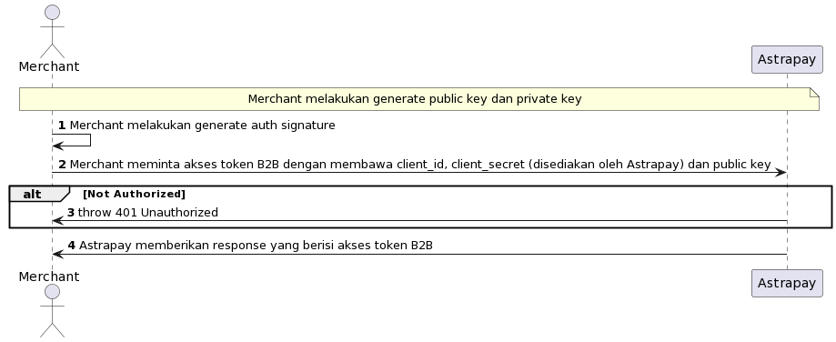

# Snap Keamanan


Snap keamanan AstraPay menggunakan enkripsi simetris dengan token ber-*Standard Symmetric Encryption Signature
HMAC_SHA512 (512 bits)*. Ada 4 komponen yang dibutuhkan untuk berkomunikasi:

- **Client ID**: adalah *Client Identifier* yang bersifat unik yang diterbitkan oleh AstraPay untuk akun Anda
- Client Secret: adalah Secret Key yang digunakan untuk mengamankan enkripsi setiap request yang dikirim.
- Public Key: adalah Public Key yang bersifat unik, diterbitkan oleh Anda dan diberikan kepada Astrapay.
- Private Key: dibuat Private Key yang bersifat unik, diterbitkan oleh Anda dan disimpan oleh Anda sendiri.

**Catatan** : Client Secret dan Private Key bersifat rahasia, dilarang membagikan Client Secret dan atau Private Key
kepada siapapun.

Untuk api keamanan, perlu diperhatikan tiga proses yaitu:
 1. [ Generate Signature Auth ](#generate-signature-auth)
 2. [ API B2B Access Token Request ](#access-token)
 3. [ Generate Signature Service ](#generate-signature-service)



## Generate Private Key dan Public Key

Cara generate private key dan public key, bisa melalui beberapa cara diantaranya generator online, logic coding atau
melalui terminal/cmd. Untuk private key nantinya akan disimpan oleh merchant atau pengguna, sedangkan public key akan
disimpan oleh merchant atau pengguna dan dibagikan ke AstraPay atau penyedia. Berikut merupakan penjelasan cara generate
melalui terminal/cmd.

- Untuk generate Private Key di terminal atau cmd, silahkan ketik command line dibawah:


openssl genrsa -out rsa_private_key.pem 2048
- Untuk meng-export Public Key, di terminal ataum cmd, ketik command line dibawah:


openssl rsa -in rsa_private_key.pem -out rsa_public_key.pem -pubout
- Encode Private Key to PKCS#8 


openssl pkcs8 -topk8 -in rsa_private_key.pem -out pkcs8_rsa_private_key.pem -nocrypt

Untuk mengeluarkan nilai value dari file private_key atau public_key yang sudah tergenerate bisa dibuka dengan command
line atau explorer. Dengan nama:

- pkcs8_rsa_private_key.pem = untuk private key
- rsa_public_key.pem = untuk public key.

## Generate Signature Auth

Signature auth digunakan sebagai salah satu request header di api B2B Access Token Request. Dibawah ini merupakan
langkah-langkah untuk men-generate signature auth.

1. Format payload untuk men-generate signature sebagai berikut:

`
[X-CLIENT-KEY] + "|" + [X-TIMESTAMP]
`
2. Signature yang sudah di generate sebelumnya dihasilkan dengan meng-aplikasikan enkripsi SHA-256 with RSA-2048 yang menggunakan private key pkcs8, kemudian hasilnya di encode menjadi base64.
3. Masukkan signature kedalam HTTP header “X-SIGNATURE” di api B2B Access Token Request
Contoh X-Signature yang sudah di generate:

`
85be817c55b2c135157c7e89f52499bf0c25ad6eeebe04a986e8c862561b19a5
`

## API Access Token B2B

### Protocol dan Service Address


| Item | Value |
| --- | --- |
| Protocol | HTTPS |
| Verb | POST |
| API Name | Access Token B2B |
| Function | API ini digunakan untuk mengambil token otorisasi berdasarkan client_id dan client_secret. Token digunakan untuk otorisasi HTTP Header |
| Service Code | 73 |
| Content type | application/json |
| URL | snap-service/snap/v1.0/access-token/b2b |


### Request

**Contoh cURL**

```shell
curl --location --request POST '/snap-service/snap/v1.0/access-token/b2b' \
--header 'x-client-key: client_id' \
--header 'x-timestamp: 2020-01-01T00:00:00+07:00' \
--header 'x-signature: KELOUOwWABn9/7gDrJ2ISSrf17xxxxxx' \
--header 'Content-Type: application/json' \
--data-raw '{
    "grantType": "client_credentials"
}'
```

### Header


| Field | Type | Requirement | Description |
| --- | --- | --- | --- |
| Content-type | String | Mandatory | Tipe konten, data yang dikirim harus selalu application/json |
| X-TIMESTAMP | String | Mandatory | Waktu lokal Merchant/Partner dalam format yyyy-MM-ddTHH:mm:ssTZD |
| X-CLIENT-KEY | String | Mandatory | Merchant/Partner client_id |
| X-SIGNATURE | String | Mandatory | Signature untuk API keamanan B2B Access Token Request (Siganture Auth).Verifikasi signature dapat dilakukan dengan menggunakan public key yang diberikan oleh Merchant/Partner |


### Body


| Field | Type | Requirement | Description |
| --- | --- | --- | --- |
| grantType | String | Mandatory | Data yang dikirim merupakan client_credentials |


### Response

**Contoh Response**

```shell
Content-type: application/json                                  
X-TIMESTAMP: 2022-03-22T14:45:43+07:00                                  
X-CLIENT-KEY: 85be817c55b2c135157c7e89f52499bf0c25ad6eeebe04a986e8c862561b19a5                                  
{                                   
  "responseCode": "2007300",                                    
  "responseMessage": "Successful",                                    
  "accessToken": "DlHTC8U5urS6VDsWkNMv3ealeldgjR8H5CvYYfD8n5xxx",
  "tokenType": "Bearer",
  "expiresIn": "900"
}
```

### Header


| Field | Type | Requirement | Description |
| --- | --- | --- | --- |
| Content-type | String | Mandatory | Tipe konten, data yang dikirim harus selalu application/json |
| X-TIMESTAMP | String | Mandatory | Waktu lokal Merchant/Partner dalam format yyyy-MM-ddTHH:mm:ssTZD |
| X-CLIENT-KEY | String | Mandatory | Merchant/Partner client_id |


### Body


| Field | Type | Requirement | Description |
| --- | --- | --- | --- |
| responseCode | String | Mandatory | Lihat response list |
| responseMessage | String | Mandatory | Lihat response list |
| accessToken | String | Conditional | Token Akses B2B |
| tokenType | String | Conditional | Tipe dari token otorisasi, selalu berisi **“Bearer”** |
| expiresIn | String | Conditional | Durasi aktif dari token. Secara default **900 Detik**. |


## Generate Signature Service

Signature service digunakan sebagai salah satu request header (X-SIGNATURE) di API Service SNAP BI yang dihubungkan. Dibawah ini merupakan langkah-langkah untuk men-generate signature service.

1. Format payload untuk men-generate signature service adalah sebagai berikut:

`
[HTTP METHOD] + ”:” + 
[RELATIVE PATH URL] + “:“ + 
[B2B ACCESS TOKEN] + “:“ + 
LowerCase(HexEncode(SHA-256(Minify([HTTP BODY])))) + “:“ + 
[X-TIMESTAMP]
`
2. Signature yang sudah di generate sebelumnya dihasilkan dengan mengaplikasikan HMAC_SHA512 hashing menggunakan Client Secret yang diberikan AstraPay, kemudian hasilnya di encode menjadi base64.
3. Masukkan signature kedalam HTTP header “X-SIGNATURE” di API SNAP yang akan digunakan.
Contoh X-Signature yang sudah di generate:

`
06a7c024bd3927ecea861ddb8605f96b382cd09e8f0ed71a4c4e8c810627212dd6973ab495b405a14dbad54f9fe23f8873b33ebcc546e2766912b7de4c225ef5
`

Untuk request dengan metode GET, meskipun secara umum tidak memiliki request body sesuai dengan spesifikasi HTTP, API ini tetap mengharuskan klien untuk menghitung hash SHA-256 dari objek JSON kosong {} sebagai bagian dari proses otentikasi atau pembuatan signature.

### Response List


| Response Code | Service Code | Case Code | Response Message | Description |
| --- | --- | --- | --- | --- |
| 200  **OK** | any | 00 | Successful | Client berhasil teridentifikasi dan akses token diberikan. |
| 400  **Bad Request** | any | 01 | Invalid Field Format | Format field tidak benar. |
| 400 **Bad Request** | any | 02 | Invalid mandatory field {fieldName} | Data yang dibutuhkan tidak ada atau tidak lengkap. |
| 409 **Duplicate** | 47 | 01 | Duplicate partnerReferenceNo | partnerReferenceNo sudah ada pada sistem. |
| 404 **Not Found** | 47 | 17 | Invalid Terminal | Terminal code tidak ada di sistem. |
| 404 **Not Found** | 51 | 08 | Invalid Merchant | Merchant id tidak ada di sistem atau status merchant *abnormal*. |
| 500 **Internal Server Error** |  |  | Respons tidak valid dari Back-end atau Kesalahan Tidak Terdefinisi |  |

