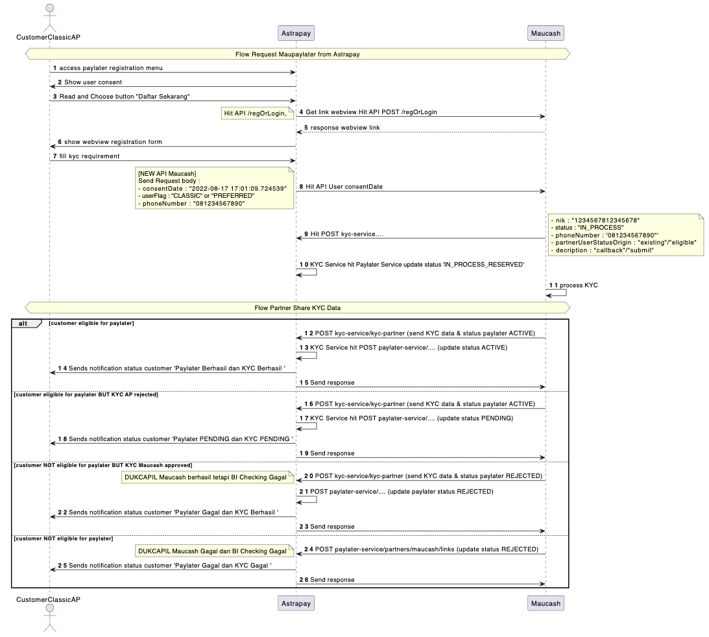

# Paylater


Selamat datang di dokumentasi Astrapay Paylater

## Auto-Preferred User Classic

### Flow Diagram Auto-Preferred

Berikut adalah alur gambaran proses auto-preferred customer Astrapay



### Authorization

Credential yang dibutuhkan yaitu :

- **Client ID** : Client Identifier yang bersifat unik yang diterbitkan oleh Astrapay untuk Maucash
- **IP Whitelist** : IP yang dimiliki oleh Maucash yang di whitelist

## API Paylater Registration

API yang digunakan untuk melakukan update status registrasi paylater di Astrapay

### URL for Request

**Contoh cURL Registration Paylater**

```shell
curl --location 'https://paylatersvc.astrapay.com/paylater-service/partners/links' \
--header 'x-client-id: xxx14f325-x5x5-xx7x-bxxb-8xxxf6x1x12a' \
--header 'Content-Type: application/json' \
--data '{
    "phoneNumber" : "081234567890",
    "status" : "ACTIVE",
    "rejectReason" : "Data telah sesuai",
    "reapplyDate" : "2022-10-17"
}'
```


| Method | Environment | Value |
| --- | --- | --- |
| POST | Testing | https://paylatersvc-uat.astrapay.com/paylater-service/partners/links |
|  | Production | https://paylatersvc.astrapay.com/paylater-service/partners/links |


### Header for Request


| Key | Description | Environment |
| --- | --- | --- |
| x-client-id | Testing | Identifier yang diberikan oleh Astrapay |
|  | Production |  |


### JSON Body

**Sample Response 200 OK**

```json
{
      "phoneNumber" : "081234567890",
      "status" : "ACTIVE",
      "rejectReason" : "Data telah sesuai",
      "reapplyDate" : "2022-10-17"
    }
```

**Sample Response 400 FAILED**

```json
{
      "phoneNumber" : "081234567890",
      "message" : "User status is unknown",
      "error" : null
    }
```

Body for request *field required


| No | Field | Type | Length | Description |
| --- | --- | --- | --- | --- |
| 1 | phoneNumber* | String | 13 | No telepon yang digunakan oleh customer untuk registrasi |
| 2 | status | String | 255 | Status paylater customer (ACTIVE/REJECTED/BLOCKED) |
| 3 | rejectReason | String | 255 | Alasan registrasi customer ditolak/diblock |
| 4 | reapplyDate | Date |  | Tanggal customer dapat melakukan registrasi kembali |


*Keterangan value field 'message' di Response 400*


| No | Message | Description |
| --- | --- | --- |
| 1 | User status is unknown | Request status yang dikirim tidak sesuai |


## API Callback Registrasion

API ini digunakan untuk mengirimkan NIK dan status registrasi user ke Astrapay

*(will be updated soon)*

## API Share Data Customer ke Astrapay Auto-Preferred

API untuk mengirimkan data KYC customer yang pengajuan paylaternya telah di approved oleh Maucash

### URL for Request


| Method | Environment | Value |
| --- | --- | --- |
| POST | Testing | https://kyc-uat-api.astrapay.com/kyc-service/kycs-partner |
|  | Production | https://kyc-api.astrapay.com/kyc-service/kycs-partner |


### Header for Request


| Key | Environment | Description |
| --- | --- | --- |
| x-client-id | Testing | Identifier yang diberikan oleh Astrapay |
|  | Production |  |


### JSON Body

Body for request 
  ***field required**

**Contoh cURL Share Data**

```shell
curl --location --request POST 'https://kyc-uat-api.astrapay.com/kyc-service/kycs-partner' \
--header 'x-client-id: 8174f325-2565-4b7b-be1b-888df662367c' \
--header 'Content-Type: application/json' \
--data-raw '{
    "phoneNumber"                  : "082112344321", 
    "name"                         : "BERN RIANTOSE",
    "identificationDocumentType"   : "KTP",
    "identificationDocumentNumber" : "321423912332",
    "placeOfBirth"                 : "Jakarta",
    "dateOfBirth"                  : "1991-10-28",
    "nationality"                  : "WNI",
    "gender"                       : "LAKI-LAKI",
    "profession"                   : "Wiraswasta",
    "country"                      : "Indonesia",
    "province"                     : "Jawa Tengah",
    "city"                         : "Jepara",
    "district"                     : "Kalinyamatan",
    "village"                      : "Kriyan",
    "address"                      : "Jalan Makmur Raya",
    "rtNumber"                     : "04",
    "rwNumber"                     : "05",
    "postalCode"                   : "59462",
    "regionId"                     : "1102",
    "kycPhoto" : [
        {
            "type" : "KTP",
            "file" : base64
        },
        {
            "type" : "KTP",
            "file" : base64
        }
    ]
}'
```


| No | Field | Type | Length | Description |
| --- | --- | --- | --- | --- |
| 1 | phoneNumber* | String | 13 | No Telepon yang digunakan customer untuk registrasi |
| 2 | name* | String | 225 | Nama customer sesuai KTP |
| 3 | identificationDocumentType* | String | 225 | Tipe dokumen (diisi: KTP) |
| 4 | identificationDocumentNumber* | String | 225 | Nomor KTP customer |
| 5 | placeOfBirth* | String | 255 | Tempat lahir sesuai KTP |
| 6 | dateOfBirth* | 255 | String | Tanggal lahir sesuai KTP |
| 7 | nationality* | String | 255 | Kewarganegaraan (diisi: WNI) |
| 8 | gender* | String | 225 | Jenis kelamin customer sesuai KTP (PEREMPUAN/LAKI-LAKI) |
| 9 | profession* | String | 255 | Pekerjaan/profesi customer |
| 10 | country* | String | 255 | Negara sesuai KTP |
| 11 | province* | String | 255 | Provinsi sesuai KTP |
| 12 | city | String | 255 | Kota sesuai KTP |
| 13 | district* | String | 255 | Kecamatan sesuai KTP |
| 14 | village* | String | 255 | Provinsi sesuai KTP |
| 15 | address* | String | 255 | Kelurahan/Desa sesuai KTP |
| 16 | rtNumber* | String | 255 | Alamat sesuai KTP |
| 17 | rwNumber* | String | 255 | Nomor RT sesuai KTP |
| 18 | postalCode* | String | 255 | Nomor RT sesuai KTP |
| 19 | regionId* | String | 255 | Kode Pos customer sesuai alamat KTP |
| 20 | kycPhoto* | ArrayObject |  | File KTP dan SELFIE customer |
| 21 | file* | Base64 |  | Tipe foto/dokumen yang dikirim (KTP/SELFIE) |
| 22 | type* | String | 255 | Foto yang sudah di convert menjadi base64 |


### Response (JSON String)

Response ini berupa informasi tentang berhasil tidaknya auto-preferred customer yang bersangkutan di Astrapay

**Sample Response 200 OK**

```json
{
      "phoneNumber" : "082112344321", 
      "status" : "SUCCESS",
      "note" : "",
      "upgradeMethod" : "MAUCASH"
    }
```

**Sample Response 400 FAILED**

```json
{
      "phoneNumber" : "082112344321", 
      "status" : "FAILED",
      "note" : "NIK already exist",
      "upgradeMethod" : "MAUCASH"
    }
```


| No | Field | Type | Description |
| --- | --- | --- | --- |
| 1 | phoneNumber* | String | No Telepon yang digunakan customer untuk registrasi |
| 2 | status* | String | Status auto-preferred (SUCCESS/FAILED) |
| 3 | note | String | Informasi alasan gagalnya auto-preferred di Astrapay (*field ini hanya akan berisi jika autopreferred gagal) |
| 4 | upgradeMethod* | String | Informasi tentang partner yang telah mengirimkan data KYC (MAUCASH) |


*Keterangan value field 'note' di Response 400*


| No | Note | Description |
| --- | --- | --- |
| 1 | NIK already exist | Nomor KTP yang dikirimkan sudah digunakan oleh customer lain di Astrapay |
| 2 | Region Not Found | Data region yang dikirimkan tidak ditemukan di Astrapay |
| 3 | Profession Not Found | Data profession yang dikirimkan tidak ditemukan di Astrapay |
| 4 | User Not Found | Nomor telepon customer yang dikirimkan tidak ditemukan di Astrapay |
| 5 | Mandatory field must be filled | Salah satu field mandatory tidak diisi atau kosong |


## API Reminder Repayment

API yang digunakan untuk mengirimkan notifikasi reminder pembayaran tagihan MauPaylater

### URL for request


| Method | Environment | Value |
| --- | --- | --- |
| POST | Testing | https://paylatersvc-uat.astrapay.com/paylater-service/notification |
|  | Production | https://paylatersvc.astrapay.com/paylater-service/notification |


### Header for request


| Key | Description | Environment |
| --- | --- | --- |
| x-client-id | Testing | Identifier yang diberikan oleh Astrapay |
|  | Production |  |


### JSON Body

**Sample Body Request**

```json
{
      "action" : "REPAYMENT_REMINDER", 
      "phoneNumber" : "087888784321", 
      "data" : [
                {
                  "key": "status",
                  "value": "LATE" }
      ]
    }
```

**Sample Response Body**

```json
{
      "phoneNumber" : "087888784321",
      "action" : "REPAYMENT_REMINDER"
    }
```

Body for request 
  ***field required**


| No | Field | Type | Length | Description |
| --- | --- | --- | --- | --- |
| 1 | action | String | 255 | Keterangan untuk tipe notifikasi (*permanent : `REPAYMENT_REMINDER`) |
| 2 | phoneNumber | String | 13 | No telepon yang digunakan oleh customer untuk registrasi |
| 3 | data | ArrayObject |  |  |
|  | key | String | 255 | Kategory dari value (*permanent : `status` ) |
|  | value | String | 255 | Status reminder tagihan user; 1. TODAY, 2. ONE_DAY, 3. TWO_DAYS, 4. LATE |

